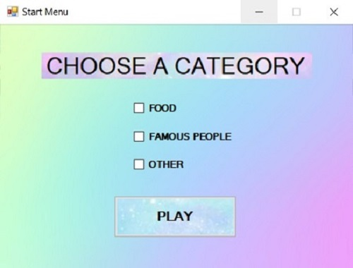
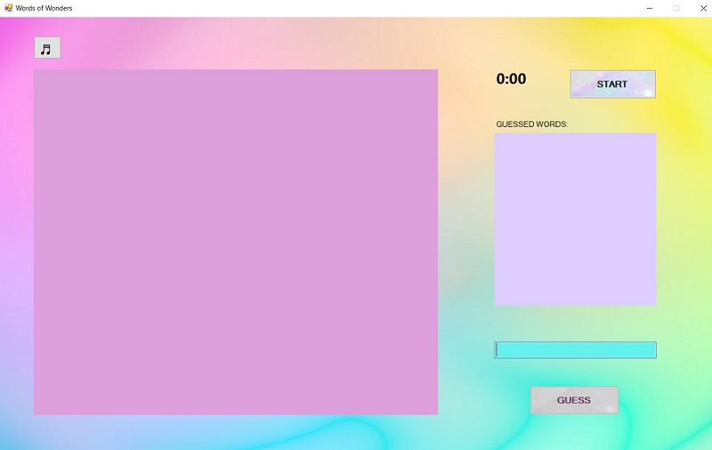
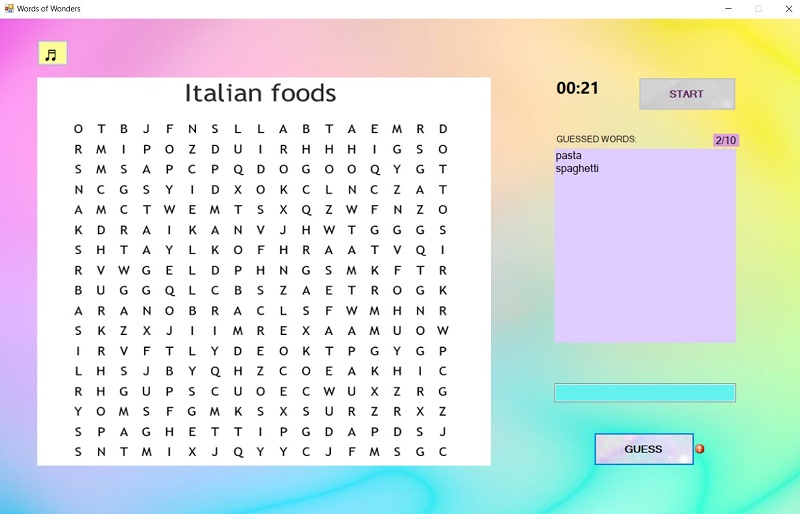
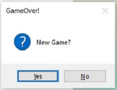

# Words Of Wonders
 Проектна задача по предметот Визуелно програмирање   
 Изработиле: Ева Спировска - 181512 и Емилија Трајаноска - 181511
   
   
 ## 1.	Опис на играта
 **Words of Wonders** е игра наменета за еден играч. При нејзиното вклучување на корисникот ќе му бидат понудени три категории (food, famous people и other) од кои треба да одбере само една,  а потоа на екранот ќе му биде прикажано поле од букви за кои ќе треба да ги погоди  дадените зборови соодветно за претходно селектираната категорија. Зборовите можат да бидат пронајдени хоризонтално, вертикално и дијагонално во даденото поле од букви.  Исто така на играчот ќе му биде дадено одредено време за кое ќе треба да ги погоди сите зборови и опција да вклучи или исклучи музика за време на играњето.    
Цел на играта е да се погодат сите зборови пред да истече даденото време.
 
## 2.  Упатство и правила за користење 
### 2.1 Почетно мени
При стартување на апликацијата ќе се појави соодветен прозорец за почетното мени на играта (Слика 1). Тука на корисникот ќе му биде овозможено да започне нова игра.  
 

 
Слика 1.    Почетно мени на играта Words of Wonders
  
Доколку играчот одлучи да започне нова игра најпрво ќе треба да селектира една од понудните категории:
*	Food
*	Famous people
*	Other  

за која што ќе сака да погодува зборови, а откако ќе ја избере треба да притисне на копчето Play.  
 При секој нов почеток на играта доколку повторно се селектира иста категорија, рандом ќе се генерира нова тема која се наоѓа соодветно во дадената категорија и за која играчот ќе треба да погодува зборови.
### 2.2 Нова игра
Откако играчот ќе селектира категорија и ќе притисне на копчето Play на екранот ќе му биде прикажан нов прозорец (Слика 2). Во овој прозорец ќе бидат прикажани полето каде што треба да се појават буквите, полето каде што ќе се испишуваат погодените зборови, поле за внесување на тие зборови, копче Guess, копче Start, опција за вклучување на музика и време. Играта нема да започне се додека играчот не притисне на копчето Start. 
   

 
Слика 2.    Прозорец прикажан откако ќе се притисне на копчето Play
  
Откако играчот ќе притисне на копчето Start времето ќе почне да тече и во полето наменето за букви ќе се изгенерира рандом слика со името на темата и буквите. Играчот ќе треба да ги пронајде сите зборови кои што се наоѓаат во полето хоризонтално, вертикално или дијагонално пред да истече даденото време од 10 минути. Зборовите треба да ги внесува во полето за внес и откако ќе внесе збор да притисне на копчето Guess. Доколку зборот не постои или доколку веќе бил погоден ќе биде прикажана соодветна порака до полето за внес. Погодувањето на зборовите играчот ќе може да го направи и со притискање на копчето Enter на тастатурата.
   

 
Слика 3.    Траење на играта
  
Играта ќе биде завршена откако играчот ќе ги погоди сите зборови. Соодветно ќе биде прикажан прозорец дека играта завршила и играчот победил, а потоа ќе му биде овозможено да започне нова игра од истата или друга категорија. Ако играчот не стигне да ги погоди сите зборови пред да истече времето, на екранот ќе се појави прозорец каде што ќе треба да избере опција дали сака да започне со нова игра. Доколку одговори потврдно ќе остане во истата категорија и ќе добие нова тема од истата, а во спротивно ќе биде вратен на почетното мени каде што ќе може да избере друга категорија.
   
  
 
Слика 4.    Прозорец прикажан ако истече времето / ако се погодат зборовите                           
## 3.	Решение на проблемот - структура и организација на код
### 3.1 Класи и форми
Главните податоци и функции за играта се чуваат во две класи: public class Words и public class Game.
* **Words класата** – содржи низа за секоја од темите кои што се наоѓаат во трите категории. Секоја низа ги содржи соодветно сликата со букви и сите зборови кои што треба да се погодат за таа тема. Во оваа класа има една функција *public string[] pick()* која според избраната категорија генерира рандом поле со соодветни букви за темата.
* **Game класата** – чува објект од класата Words и HashSet во кој што се чуваат погодените зборови. Има две функции едната е *public string show()* преку која зборовите што треба да се погодат се ставаат во дадениот *HashSet*, а втората е *public bool guessW(string word)* со која се прави проверка дали погодениот збор се содржи во наведените зборови кои што треба да се погодат. Доколку се содржи зборот се брише од HashSet и функцијата враќа вредност *true*, а доколку не е погоден враќа *false*.

Оваа апликација е составена од две главни форми Form1 и Form2.
* **Form1** – содржи четири методи каде што еден од нив се повикува при стискање на копчето Play, а останатите три методи се повикуваат соодветно за категоријата што е селектирана. 
* **Form2** – содржи повеќе променливи. Тие се името на сликите, дадената категорија, објект од класата Game, променлива назначена за бројач на погодени зборови, целобројни променливи *timeOut* и *maxTime* кои се однесуваат на тајмерот, Boolean променлива *OnOff* и *private SoundPlayer Player* за музиката. Во оваа форма исто така има осум функции. Функција која се повикува при стискање на копчето Start кое што овозможува почеток на играта, метод за копчето Guess кој што го проверува зборот, метод за копчето за музика и нејзино вклучување и исклучување. Исто така има соодветна функција која се повикува доколку се затвори формата која ја запира музиката, два методи за тајмерот кои прават проверка на времето, метод *private void endGame(int tmp)* кој што прави проверка дали играта е завршена и методот *private void guess()* преку кој што се повикува методот *public bool guessW(string word)* од класата Game и се прикажува соодветна порака за дадениот збор.
### 3.2 Детален опис на некои од функциите
Функцијата *private void endGame(int tmp)* од Form2 се повикува од функцијата *private void guess()* како и при секоја измината секунда од тајмерот. Оваа функција како влез има една целобројна променлива. На почеток *btnGuess.Enabled = false;* полето со погодени зборови се ресетира со тоа што сите зборови се бришат, полето за внес се поставува да биде празно, се бришат двата error providers доколку биле прикажани и се прават две проверки. Првата проверка се прави доколку променливата што ја има како влез оваа функција е еднаква на 1, тоа значи дека *endGame* функцијата е повикана поради успешно завршена игра преку *guess* функцијата и соодветно се прикажува прозорец со порака дека играта е успешно завршена. При стискање на копчето ОК на прикажаниот Message box се затвора оваа форма. Доколку овој услов не е задоволен тоа значи дека играта не е успешно завршена и оваа функцијаа била повикана бидејќи даденото време изминало. Во овој случај се појавува Мessage box со соодветна порака и две опции yes и no. Доколку се избере yes формата не се затвора, копчето Start се поставува да биде  *btnStart.Enabled = true;* Ако се избере опцијата no музиката се исклучува и има пренасочување на Form1 каде што е претставено почетното мени.  
 <pre><code>   private void endGame(int tmp)
        {
            btnGuess.Enabled = false;
            Words.Items.Clear();
            tbGuess.Text = "";
            errorProvider1.Clear();
            errorProvider2.Clear();
            if (tmp == 1)
            {
                Timer1.Stop();
                var result = MessageBox.Show("", "Congrats!", MessageBoxButtons.OK);

                if (DialogResult.OK == result)
                    this.Close();
            }
            else
            {
                var result = MessageBox.Show("New Game?", "GameOver!", MessageBoxButtons.YesNo, MessageBoxIcon.Question);

                if (DialogResult.Yes == result)
                {
                    btnStart.Enabled = true;
                    pictureBox1.Image = null;
                }
                else
                {
                    Player.Stop();
                    this.Close();
                }

            }
        }
        </code></pre> 
Функцијата *private void button1_Click(object sender, EventArgs e)* е функција која што се повикува при стискање на копчето за вклучување и исклучување на музиката кое што се наоѓа над полето со дадените букви. Во оваа функција има две проверки. Првата проверува дали променливата *OnOff* е поставена на *false*. Доколку е, тоа значи дека музиката не е вклучена и при стискање на соодветното копче се вклучува музиката преку *Player.PlayLooping();*  на копчето се поставува жолта боја и променливата *OnOff* се поставува да има вредност *true* што ќе означува дека музиката е вклучена. Доколку променливата *OnOff* е поставена на true при стискање на копчето музиката се исклучува со *Player.Stop();* копчето ја менува бојата во сива, а променливата *OnOff* се поставува на *false* што ќе означува дека музиката е исклучена.
<pre><code>
private void button1_Click(object sender, EventArgs e)
        {
            if (OnOff == false)
            {
                button1.BackColor = Color.FromArgb(253, 253, 150);
                Player.PlayLooping();
                OnOff = true;
            }
            else
            {
                button1.BackColor = Color.FromArgb(220, 220, 220);
                Player.Stop();
                OnOff = false;
            }
        }
</code></pre>
